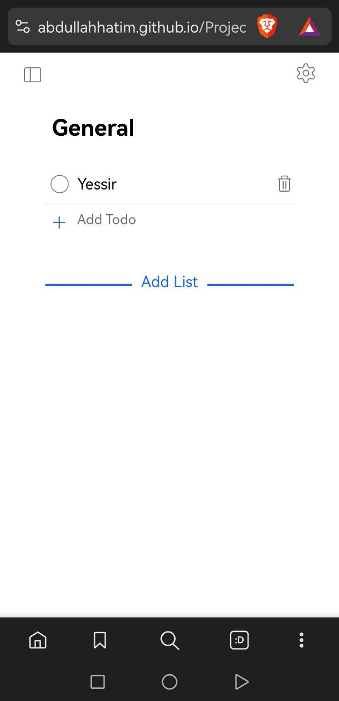
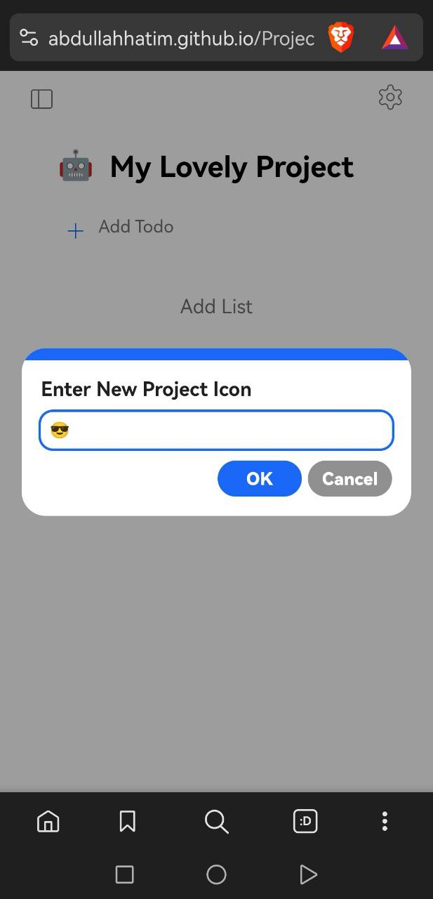
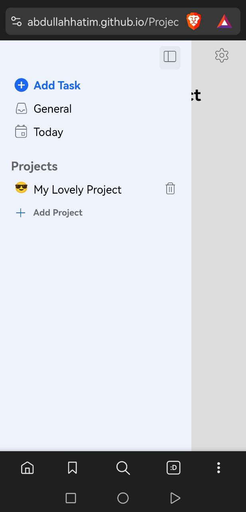
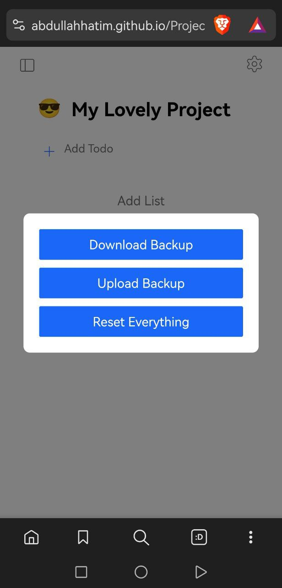

# Project Todo List

This project is a Todo List application built as part of The Odin Project curriculum.

  

<strong>ToDoing: "Plan Less, Start Doing" - Your New Favorite Productivity App</strong> 
Organize, Prioritize, and Complete your todos using a clean interface. All your data are stored on your device.

---

**Website:** [todoing.com](https://abdullahhatim.github.io/Project-Todo-List-TOP/)

Works Great on Mobile TOO LES GOOOOOOOOOOO

## Showcase

<strong>Desktop</strong>

  
  
  
  
  
  

<strong>Mobile</strong>

  
  
  
  

## My Experience

WOW what a long project this has been, i saw that one guy who spent 3 weeks
and i said "ain't no way it takes that long" but then i realized this is a
project that i can actually put on my portfolio and i had to make an effort

I am proud of how this turned out, learned and gained experience and the
feeling of finishing a project is just one of a kind, also if you can't
really tell the design is inspired by "Todoist"

I like this so much infact i am probably gonna use it myself

## Project Time

Start: March 12, 2025

End: March 29, 2025

64+ Hours spent on this project
with about an average of 4 Hours daily, the last few days have been a 6-7 hours days

## Notes

1. I believe I improved my file organization
2. I think I followed correct design principles
3. Had a hard time figuring out what to name my CSS color variables and which ones to even include. I wish there was a website which has ready-to-use CSS variables that you just copy and paste into your project
4. Took an entire day to make that side slide-out animation mainly because I think CSS is not really intuitive
5. Man oh man this ".innerHTML +=" caused me pain since it kept breaking my page loading for no reason. If you want to avoid this pain don't use .innerHTML on an element more than once, don't use the "+" sign
6. Accessors are important for private properties, otherwise your data goes poof
7. Day 9 was super smooth الحمدلله almost everything worked like I wanted
8. Took another full day to make my custom modal. You can probably rewrite it for your own use case (I think I made it simple enough)
9. Getting side tracked so much with wanting this feature, wanting that feature - I had to hold myself together to finish this project
10. Git is a pain to the soul but figured out (with some research) how I can avoid the pain of deploying my website. Ended up making a nushell script that does everything (ask me if you want that script)
11. 14 days in and I let AI code a little bit, and no I didn't vibe code - I had to constantly and manually correct its mistakes
12. I find it funny how no matter how much you perfect your code, there is gonna be some bugs and it's fascinating to glitch your code
13. i knew exactly what i wanted in the settings but didn't know how to implement them, this is where ai is really helpful although it didn't write perfect code, infact i had to correct almost everything it created so once again i knew what it was writing, this backup feature is a game changer i think
14. Finally finished the project at the time of writing this README and I feel like a big brain, but gotta keep learning - the road is still long, may god make things easy

[message me](https://t.me/Soo0B)
